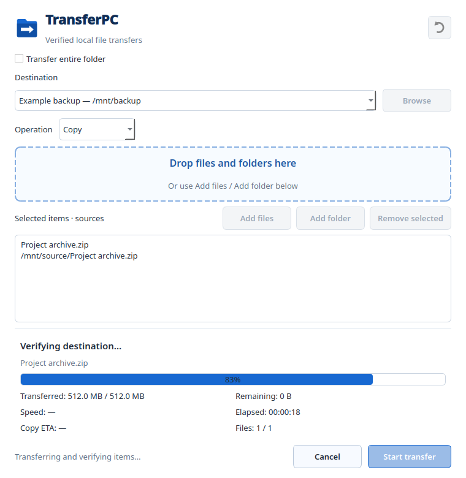
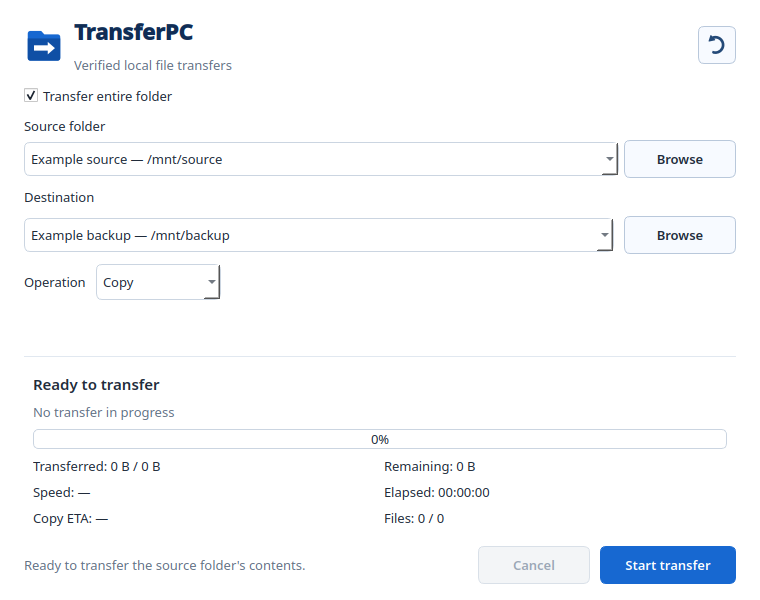

<p align="center">
  
</p>
<h1 align="center">TransferPC</h1>
<p align="center"><strong>Verified local file transfers for Linux · v1.0</strong></p>
<p align="center">Copy or move files with clear progress, checksum verification and safe overwrite confirmation.</p>
<p align="center">
  <a href="LICENSE">MIT License</a> ·
  <a href="https://github.com/jotadev27/TransferPC/releases">Downloads</a> ·
  <a href="SECURITY.md">Security &amp; privacy</a>
</p>

<p align="center">
  
  <br><sub>Overall progress includes copying, both checksum passes and finalization.</sub>
</p>

## Features

- Drag and drop files or folders, or use the file picker.
- Copy or move selected items, including nested and empty folders.
- Transfer a folder's contents directly with **Transfer entire folder**.
- Choose local directories or mounted drives; refresh locations after connecting storage.
- Follow overall progress, copied bytes, remaining copy size, speed, elapsed time and copy ETA.
- Verify SHA-256 checksums before and after publishing files at the destination.
- Confirm replacement of existing regular files with **Yes** or **Cancel**. The previous file is retained until verification finishes.
- Cancel before source removal; Move deletes sources only after successful verification.
- Remove selected queue items after an error and retry with a corrected destination.

## Install or run

TransferPC targets **Ubuntu 22.04+, Fedora and Manjaro/Arch Linux**.
Release binaries are for **x86_64**. The bundled packages and portable require
**glibc 2.35 or newer**, OpenGL/EGL libraries and a desktop session.

The following commands download and install **v1.0**. They work after the
maintainer publishes the release assets on GitHub. Choose the block for your
system; run it from a directory where you want to keep the downloaded package.

### Ubuntu 22.04 or newer

```bash
sudo apt update && sudo apt install -y curl
curl -fLO https://github.com/jotadev27/TransferPC/releases/download/v1.0/transferpc_1.0-1_amd64.deb
sudo apt install ./transferpc_1.0-1_amd64.deb
transferpc
```

Python and Qt are included in the DEB. Remove it with
`sudo apt remove transferpc`.

### Manjaro / Arch Linux

```bash
sudo pacman -Syu --needed curl
curl -fLO https://github.com/jotadev27/TransferPC/releases/download/v1.0/transferpc-1.0-1-x86_64.pkg.tar.zst
sudo pacman -U ./transferpc-1.0-1-x86_64.pkg.tar.zst
transferpc
```

Python and Qt are included in the pacman package. Remove it with
`sudo pacman -R transferpc`.

### Fedora

```bash
sudo dnf install -y curl
curl -fLO https://github.com/jotadev27/TransferPC/releases/download/v1.0/transferpc-1.0-1.fc44.noarch.rpm
sudo dnf install ./transferpc-1.0-1.fc44.noarch.rpm
transferpc
```

The RPM uses Fedora's Python 3.10+ and PySide6 6.6+ packages and was built on
Fedora 44. Remove it with `sudo dnf remove transferpc`.

All installed packages add TransferPC to the application menu. They do not
require a source checkout or a development environment after installation.

### Portable: Ubuntu, Fedora and Manjaro

With `curl` and `tar` available:

```bash
curl -fLO https://github.com/jotadev27/TransferPC/releases/download/v1.0/transferpc-1.0-linux-x86_64-portable.tar.gz
tar -xzf transferpc-1.0-linux-x86_64-portable.tar.gz
cd TransferPC-1.0
./transferpc
```

Keep the complete extracted folder together, including `_internal/`. Python
and Qt are bundled; no application installation or root privileges are needed.
The portable is built on Ubuntu 22.04 instead of Fedora so it can run on older
Linux systems. It requires glibc 2.35+; Alpine/musl systems are not supported.

Validation includes Ubuntu 22.04 container tests, Fedora startup checks and
pacman package checks in an Arch container. A full Manjaro desktop session has
not been tested. Desktop drivers and library availability can still vary.

### Install from source before release assets are available

Requires Python 3.10+. Install the tools for your distribution first:

Ubuntu:

```bash
sudo apt update && sudo apt install -y git python3 python3-venv
```

Manjaro / Arch:

```bash
sudo pacman -Syu --needed git python python-pip
```

Fedora:

```bash
sudo dnf install -y git python3 python3-pip
```

Then use the same commands on any of the three systems:

```bash
git clone https://github.com/jotadev27/TransferPC.git
cd TransferPC
python3 -m venv .venv
.venv/bin/python -m pip install -e .
.venv/bin/python -m transferpc
```

This route installs PySide6 in an isolated environment and does not modify
system Python. Other architectures depend on suitable Python and PySide6
packages being available.

## Using TransferPC

1. Add files or folders and choose a destination.
2. Choose **Copy** to preserve sources or **Move** to remove verified sources.
3. Click **Start transfer**. If a destination file exists, confirm **Yes** to replace it or **Cancel** to leave it untouched. Equal names and sizes do not imply equal contents.
4. Wait for **Transfer verified** and 100% before disconnecting a drive.

For a directory's contents, enable **Transfer entire folder**, choose Source
and Destination, then start without adding items to the list. The source
folder itself stays in place.

<p align="center">
  
  <br><sub>Copy or move a folder's contents without building a manual queue.</sub>
</p>

New items are selected automatically. Use Ctrl or Shift to select multiple
items, then click **Remove selected**. Removing an item from the queue does
not delete its source file.

## How progress works

The bar counts actual work across the copy, staged checksum verification,
published checksum verification and filesystem finalization. It continues
advancing after every byte has been copied instead of jumping directly to
99%. Only successful worker completion displays 100%.

**Transferred**, **Remaining**, **Speed** and **Copy ETA** describe the copy
phase. **Files** counts files whose staged checks have passed. Destination
checks may still be running when those counters reach their totals. The bar
represents completed work, not an exact prediction of elapsed time; flushing
storage or scanning directories can pause it while the current phase remains
visible.

## Safety and privacy

TransferPC operates locally. Its runtime does not upload files, collect
analytics, run transferred files, open a listening server or offer remote
access. Public repository access does not grant access to the maintainer's
computer. Documentation screenshots use fictional paths.

Existing folders, symbolic links and special files cannot be overwritten.
Keep source contents unchanged during a transfer. Permissions and timestamps
follow destination filesystem defaults. Replacement keeps the old file until
verification; a failure before Move cleanup restores it. If rollback fails,
the backup location is reported and retained.

A failure after publication may leave destination items. Inspect both
locations before retrying. Cancellation cannot interrupt source removal once
that final Move phase starts. File verification is an integrity check, not a
malware scan. Review third-party changes and dependencies before running them.
See [SECURITY.md](SECURITY.md) for the reviewed boundaries and limitations.

## Development and release builds

Run the automated transfer, UI and runtime-boundary checks:

```bash
.venv/bin/python -m unittest discover -s tests -v
python3 packaging/audit_public.py
```

On Fedora 44, release builds require `rpm-build`, `desktop-file-utils`,
`podman`, system Python and PySide6. The RPM is built on the host; the portable,
Ubuntu DEB and Manjaro package are built inside an official Ubuntu 22.04
container. The container downloads its own build dependencies.

```bash
python3 -m venv --system-site-packages build/packaging-venv
build/packaging-venv/bin/python -m pip install 'PyInstaller==6.22.3'
build/packaging-venv/bin/python packaging/build_release.py
```

Output goes to **`installer/`**, which Git ignores. Build intermediates stay
in the ignored `build/` directory. Packaging uses explicit source payloads,
generic ownership metadata and bundled license notices. The container runs
the automated tests and audits the generated payloads, embedded code, glibc
requirements and standalone startup. It mounts the project as read-only,
with only `build/` and `installer/` writable.

To rebuild the bundled releases separately:

```bash
bash packaging/portable/build_container.sh
```

The RPM can be built separately with
`python3 packaging/fedora/build_rpm.py`. Run the release verifier in the build
container, where Python matches the bundled bytecode version. PyInstaller
recommends building on the oldest Linux baseline you intend to support;
see its [Linux portability guidance](https://www.pyinstaller.org/en/stable/usage.html#gnu-linux).

Release assets include a `SHA256SUMS` file. Verify downloaded assets from the
directory containing them:

```bash
sha256sum -c SHA256SUMS
```

Checksums confirm that files match the published list; they do not independently
authenticate the publisher. Regenerate documentation captures with
`PYTHONPATH=. python3 packaging/screenshots.py`.

## License

TransferPC is licensed under [MIT](LICENSE). Bundled libraries retain their
own licenses; see [third-party notices](THIRD_PARTY_NOTICES.md). The refresh
icon is provided by [SVG Repo](https://www.svgrepo.com/svg/164354/refresh-arrow)
under CC0.
